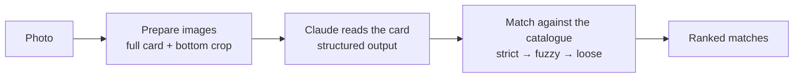

# HoloBinder card scanner

[](https://github.com/artenl/holobinder-card-scanner/actions/workflows/ci.yml)

Identifies a Pokémon TCG card from a photo. Claude reads the card, and the reading is matched against a card database, with fuzzy correction for misread set codes.

This is the card detection system from [HoloBinder](https://www.holobinder.com), a collection manager for English, Japanese and French cards, extracted into a standalone TypeScript project. The app runs the same pipeline against its own Postgres database. This repository uses the open [TCGdex](https://tcgdex.dev) API instead, so all it needs is an Anthropic API key.

```
$ npm run scan -- castform.png
Claude read:
  ポワルン たいようのすがた · set SV7a · no. 006/064 · ja
  The bottom edge clearly reads regulation mark H, set code sv7a and number
  006/064 with a C rarity mark. The card is the Japanese Castform Sunny Form,
  a Fire type with 70 HP. (confidence 0.97)

Best matches:
  1.00  ポワルン たいようのすがた (SV7a-006)
        ← set code, card number, name, HP, type, rarity
```

## How it works



A Pokémon card is identified by two things printed at its bottom edge: the **set code** (`SV7a`, `SCR`) and the **collector number** (`006/064`). The pipeline is built around reading those two reliably and recovering when it doesn't.

### 1. Two images instead of one

In a photo of a whole card, the set code is a few pixels tall. Along with the full card, the scanner sends a crop of the bottom 30%, enlarged to 1536 px wide, and tells Claude to read the code and number from it. EXIF rotation is applied first, so "bottom" is the bottom of the card as photographed.

→ [`src/image/prepare-images.ts`](src/image/prepare-images.ts)

### 2. Reading from a fixed vocabulary

The prompt lists every known set code, English and Japanese, generated from TCGdex, so Claude picks a code from a list rather than transcribing one freely. It is also told which characters are easy to confuse on these cards (1 and 7, 5 and S, 0 and O) and not to mistake the regulation mark for the set code.

The response is a [structured output](https://platform.claude.com/docs/en/build-with-claude/structured-outputs) checked against a Zod schema, so there is no JSON to clean up and no parse step that can fail.

→ [`src/vision/prompt.ts`](src/vision/prompt.ts), [`src/vision/card-reading.ts`](src/vision/card-reading.ts), [`src/vision/read-card.ts`](src/vision/read-card.ts)

### 3. Matching, from strict to loose

Misreads still happen, so matching tries five strategies, from the most specific evidence to the least:

| #   | Strategy                                                                           | Score                                |
| --- | ---------------------------------------------------------------------------------- | ------------------------------------ |
| 1   | Set code + number                                                                  | 0.98 if the name agrees, 0.70 if not |
| 2   | **Corrected** set code + number: every known code one edit away from what was read | 0.93 if the name agrees, 0.60 if not |
| 3   | Set code + name (the number is missing or misread)                                 | 0.75                                 |
| 4   | Number + name (cards that print no set code)                                       | 0.50                                 |
| 5   | Name only                                                                          | 0.30                                 |

Strategy 2 is the fuzzy step. A code within [Levenshtein distance](https://en.wikipedia.org/wiki/Levenshtein_distance) 1 of the reading is a candidate correction, and the card name decides which correction is right.

Candidates add up across strategies until one scores 0.9 or more. This matters when a misread code is itself a real set. Read `SV7a` as `SV1a` and strategy 1 finds a real card, SV1a 006, but its name doesn't match what Claude read, so it only scores 0.70 and the search goes on. Strategy 2 then finds SV7a 006 with the right name at 0.93, and it is ranked first.

Finally, details that agree add small bonuses (name +0.08 when not already counted, HP +0.05, type +0.03, rarity +0.02) to break ties, and the top five are returned.

→ [`src/matching/match-card.ts`](src/matching/match-card.ts), [`src/matching/rank.ts`](src/matching/rank.ts), [`src/matching/text.ts`](src/matching/text.ts)

### The catalogue

Matching only depends on a two-method interface, so the card database can be swapped:

```ts
interface CardCatalog {
  listSets(): Promise<CardSet[]>
  findCards(query: CardQuery): Promise<Card[]>
}
```

- [`TcgdexCatalog`](src/catalog/tcgdex-catalog.ts) looks cards up on TCGdex, in the language the card is printed in.
- [`InMemoryCatalog`](src/catalog/memory-catalog.ts) filters an array. The tests use it with real card data.

## Running it

You need Node 22 or later and an [Anthropic API key](https://platform.claude.com/).

```bash
npm install
cp .env.example .env   # then add your ANTHROPIC_API_KEY
npm run scan -- path/to/card.jpg
```

A scan takes a few seconds. The tests need neither an API key nor a network connection:

```bash
npm test
npm run typecheck
```

### As a library

```ts
import { readFile } from "node:fs/promises"
import { scanCard } from "./src"

const { reading, matches } = await scanCard(await readFile("card.jpg"))
```

`scanCard` takes an optional `{ model, client, catalog }`. The default model is `claude-opus-5-5`.

To refresh the list of set codes after new sets are released, run `npm run build:sets`.

## Project layout

```
src/
  scan-card.ts            the pipeline: prepare → read → match
  image/                  full image + bottom crop
  vision/                 prompt, output schema, Claude call
  matching/               strategies, ranking, text comparisons
  catalog/                catalogue interface, TCGdex and in-memory versions
data/sets.json            known set codes (generated by scripts/build-set-index.ts)
examples/scan.ts          command-line scanner
test/                     unit tests, with fixtures from real cards
```

## License

[MIT](LICENSE). Card data comes from [TCGdex](https://tcgdex.dev). Pokémon is a trademark of Nintendo, Creatures and GAME FREAK; this project is not affiliated with them.
